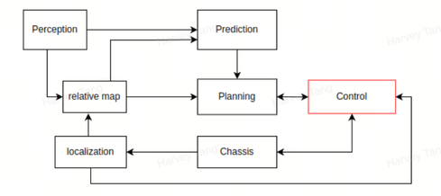
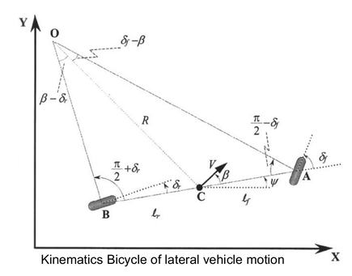
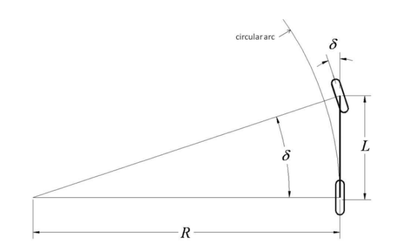
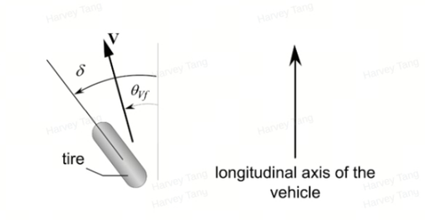
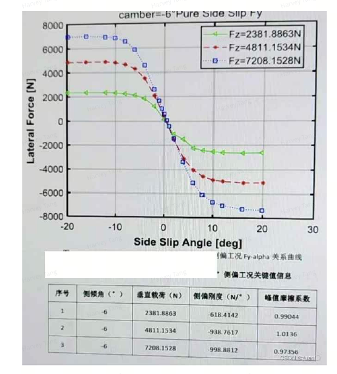
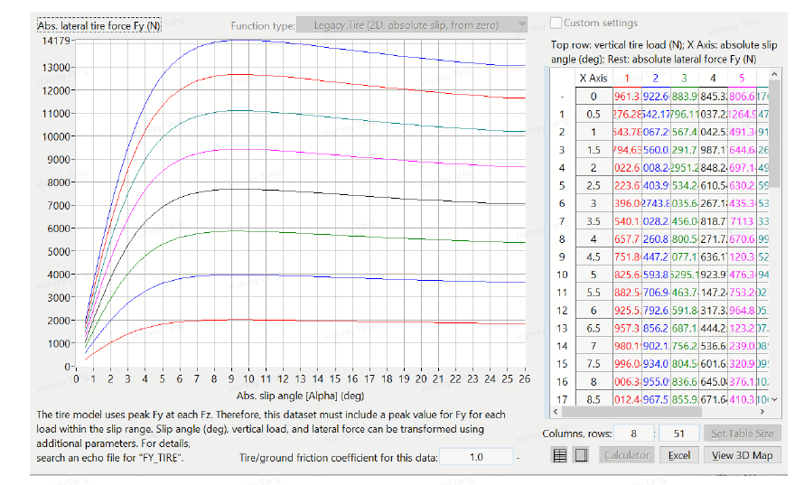
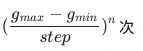
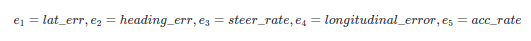
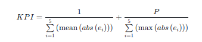

# 1 输入输出
控制模块的目标是基于规划好的轨迹和当前车辆状态，输出控制指令给车辆，为自动驾驶车辆提供舒适的驾驶体验。



- 输入：规划好的轨迹（planning）和当前车辆状态(localization && chassis)
- 输出：油门、刹车及方向盘转角(canbus)


# 2 车辆模型

## 2.1 自行车运动学模型

在自行车模型中，左右两个前轮由点 A 点的一个单轮表示。类似地，后轮由点 B 点的一个后轮表示。运动学模型中的主要假设是点 A 和 B 点的速度方向分别位于前轮和后轮的方向上。

假设：

- 车辆的运动被限制在XY平面内，即没有考虑“上升”和“下降”运动。
- 左右轮转向运动相同，左右轮合成一个轮子。
- 忽略车轮的侧偏角，A点和B点的速度方向分别位于前轮和后轮的方向上。
- 忽略负载转移带来的质心位置变化。
- 车辆是刚性车身。




### 符号定义

- $C$：车辆质心
- $\gamma = \psi + \beta$：航向角（质心速度方向与大地坐标系$\vec{X}$轴的夹角）
- $\beta$：侧偏角（质心速度方向和车身纵轴的夹角）
- $\psi$：横摆角（车身轴线与大地坐标系$\vec{X}$轴的夹角）
- $\dot{\psi} = \frac{V}{R}$：低速情况下，假设$R$变化缓慢

  
这里假设相互作用的前后轮的侧偏角 $\beta_f$ 和 $\beta_r$ 都为0，对于车辆的低速运动（例如，速度小于5 m/s），这是一个合理的假设。在低速行驶时，轮胎产生的侧向力很小，两个轮胎的总侧向力是 $\frac{mV^2}{R}$，此时前后轮的侧偏角可以近似为0（侧向力的大小与侧偏角近似成比例关系）。

### 运动学方程

AB点运动学模型的方程，可以得出：

$$
\dot{X} = V \cos(\psi + \beta)
$$

$$
\dot{Y} = V \sin(\psi + \beta)
$$

$$
\dot{\psi} = \frac{V \cos(\beta)}{l_r + l_f} (\tan(\delta_f) - \tan(\delta_r))
$$

### 阿克曼转向车辆模型

实际应用时，一般会使用后轴中心的运动学模型（B点），即阿克曼转向车辆模型。



假定 $\beta = 0$， $\delta_r = 0$，$\delta$为前轮转角，得：

$$
\dot{X} = V \cos(\psi)
$$

$$
\dot{Y} = V \sin(\psi)
$$

$$
\dot{\psi} = \frac{V}{L} \tan(\delta_f)
$$


## 2.2 车辆二自由度动力学模型
在更高的车速下，不能再假设每个车轮的速度方向都在车轮的方向上，而是需要考虑轮胎的侧向力。轮胎的侧偏角定义为轮胎方向与车轮速度矢量方向之间的夹角。



假设：

- 车辆的运动被限制在XY平面内，即没有考虑“上升”和“下降”运动。
- 车轮的转向运动相同，车轮合成一个轮子。
- 车辆是刚性车身。
- 忽略负载转移带来的质心位置变化。
- 汽车纵向速度不变，即：$V_y = C$。
- 忽略转向系统的影响，直接以前轮转角作为输入。
- 汽车横向加速度满足：$a_y \leq 0.4g$，实验结果表明，对于小的侧偏角。此时轮胎侧偏力与侧偏角近似成正比。

在上述假设下，汽车被简化为只有侧向和横摆两个自由度的两轮汽车模型。


由于质心侧偏角远小于车辆航向角和横摆角，在实际应用中可以认为航向角与横摆角相等,受力分析可以得到：
$$
(F_{yf} \cos(δ) - F_{xf} \sin(δ)) + F_{yr} = m(dv_y + v_x dψ)
$$

$$
l_f (F_{yf} \cos(δ) - F_{xf} \sin(δ)) - l_r F_{yr} = I_z d²ψ
$$
这里横向加速度带有v_x项，因为是矢量求导。

车辆的横向侧偏力可以写为

$$
F_{yf} = 2 * c_f (δ - θ_{f}) 
$$

$$
F_{yr} = 2 * c_r (-θ_{r})
$$

c_f, c_r 定义为侧偏刚度, 2 表示有两个轮子。

使用小角度假设，
$$
\tan(θ_{f}) = \frac{V_{yf} + l_{f}dψ}{V_{x}}, \quad \tan(θ_{r}) = \frac{V_{yr} - l_{r}dψ}{V_{x}}
$$

$$
θ_{f} = \frac{V_{yf} + l_{f}dψ}{V_{x}}, \quad θ_{r} = \frac{V_{yr} - l_{r}dψ}{V_{x}}
$$

$$
\cos(δ) ≈ 1, \quad \sin(δ) ≈ 0
$$

可以得到，

$$
\begin{bmatrix}
dv_y \\
d²ψ
\end{bmatrix}
=
\begin{bmatrix}
-\frac{2c_f + 2c_r}{mv_x} & \frac{2l_r c_r - 2l_f c_f}{mv_x} - v_x \\
\frac{2l_r c_r - 2l_f c_f}{I_z v_x} & -\frac{2l_f² c_f + 2l_r² c_r}{I_z v_x}
\end{bmatrix}
\begin{bmatrix}
v_y \\
dψ
\end{bmatrix}
+
\begin{bmatrix}
\frac{2c_f}{m} \\
\frac{2l_f c_f}{I_z}
\end{bmatrix}
δ
$$

定义误差：

$$
dψ = \frac{V_{x}}{R}
$$

$$
d²e_{1} = d²y + V_{x}dψ - \frac{V_{x}²}{R}
$$

$$
e_{2} = ψ - ψ_{des}
$$


其中，e₁为横向位置误差，e₂为航向角误差。

$$
dx = Ax + Bu + Cψ_{des}
$$

$$
X = \begin{bmatrix} e₁ & e₂ & d²e₁ & d²e₂ \end{bmatrix}^T, \quad u = δ
$$


$$
A = \begin{bmatrix}
0 & 1 & 0 & 0 \\
0 & -\frac{2c_f+2c_r}{mV_x} & \frac{2c_f+2c_r}{m} & -\frac{2c_f\ell_f - 2c_r\ell_r}{mV_x} \\
0 & 0 & 0 & 1 \\
0 & \frac{2c_f\ell_f - 2c_r\ell_r}{I_zV_x} & -\frac{2c_f\ell_f - 2c_r\ell_r}{I_z} & -\frac{2c_f\ell_f² + 2c_r\ell_r²}{I_zV_x}
\end{bmatrix}
$$

$$
B = \begin{bmatrix}
0 \\
\frac{2c_f}{m} \\
0 \\
\frac{2c_f\ell_f}{I_z}
\end{bmatrix} δ
, \quad
C = \begin{bmatrix}
0 \\
\frac{-2c_f\ell_f + 2c_r\ell_r - V_x}{mV_x} \\
0 \\
-\frac{2c_f\ell_f² + 2c_r\ell_r²}{I_zV_x}
\end{bmatrix}
$$

综上，车辆二自由度动力学模型可以写为：

$$
\frac{d}{dt} \begin{bmatrix}
e₁ \\
d²e₁ \\
e₂ \\
d²e₂
\end{bmatrix} = 
\begin{bmatrix}
0 & 1 & 0 & 0 \\
0 & -\frac{2c_f+2c_r}{mV_x} & \frac{2c_f+2c_r}{m} & -\frac{2c_f\ell_f - 2c_r\ell_r}{mV_x} \\
0 & 0 & 0 & 1 \\
0 & \frac{2c_f\ell_f - 2c_r\ell_r}{I_zV_x} & -\frac{2c_f\ell_f - 2c_r\ell_r}{I_z} & -\frac{2c_f\ell_f² + 2c_r\ell_r²}{I_zV_x}
\end{bmatrix}
\begin{bmatrix}
e₁ \\
d²e₁ \\
e₂ \\
d²e₂
\end{bmatrix}
+
\begin{bmatrix}
0 \\
\frac{2c_f}{m} \\
0 \\
\frac{2c_f\ell_f}{I_z}
\end{bmatrix} δ
+
\begin{bmatrix}
0 \\
\frac{-2c_f\ell_f + 2c_r\ell_r - V_x}{mV_x} \\
0 \\
-\frac{2c_f\ell_f² + 2c_r\ell_r²}{I_zV_x}
\end{bmatrix} dψ_{des}
$$

## 2.2 运动学和动力学参数标定

### 2.2.1. 运动学标定

#### 2.2.1.1 方向盘传动比标定

全局坐标系下车的自行车模型为:


上图有如下几何关系：
$$
\tan \left( \delta \right)  = \frac{L}{R}
$$

$$
\delta  = \arctan \frac{L}{R}
$$

其中, $\delta$ 为前轮转角，L为轴距，R是后轴中心运动半径，默认前轮转角不考虑阿克曼转向几何的影响。通过以上几何关系标定方向盘传动比理论上只需要测量方向盘在不同角度下的车辆运动半径即可，车辆运动半径可以使用以下两种方法:

##### a. 正三角形标定

###### 原理：


根据海伦公式可求出不同方向盘角度下的车辆转弯半径：

$$
\text{设}p = \frac{\left( a + b + c\right) }{2}
$$

面积 $S = \sqrt{p \times  \left( {p - a}\right)  \times  \left( {p - b}\right)  \times  \left( {p - c}\right) }$

$$
\text{外接圆半径}r = \frac{a \times  b \times  c}{4S}
$$

$$
R = r + l
$$

###### 流程：

- 将方向盘打到相应角度可采取EPS控制车辆方向盘至指定角度（如：300°），在靠近圆心的后轮内侧地上，做好后轮位置标记，一般为后轮中心位置（如上示意图）。

- 车辆行驶在低速情况下（5Km/h），车辆大约转过120°时，同第一个点做法一致，记下第二个后轮位置。

- 车辆继续行驶, 依次记录下剩下的点, 并保证车辆行驶回到起点, 记下车辆转过一圈后, 回到起始点位置,比较终点和起点偏差,如果轮胎位置偏差超过 ${10}\mathrm{\;{cm}}$ ,则此次测量误差较大，数据无效，重新测量。

- 测量三个点之间的距离, 并记录到表格中以计算其他数据。

##### b. 半圆标定


###### 流程

- 将测试车辆停在标有直线的测试场地, 后轴中心与直线重合（便于标记和测试轨迹直径）。将方向盘打到相应角度（如：30°），在靠近圆心的后轮侧地上，做好后轮位置标记。

- 车辆行驶在低速情况下（5Km/h），车辆大约转过180°时，车子后轴与直线再次重合（用于标定车辆转过半圈），记下后轮位置，即为终点。

- 沿测试场地上直线, 测量起点与终点之间的距离, 即为转弯内轮轨迹直径。记录到表格中以计算其他数据。

##### c. 基于RTK的方向盘传动比标定流程


###### 流程

- RTK旋转半径b=speed_RTK/omega_z（固定方向盘转角时，多组数据可以使用最小二乘法拟合出旋转半径)

- 后轴旋转半径 $\mathrm{R}\_ \mathrm{b} = \operatorname{sqrt}\left( {\mathrm{b} \land  2 - {\mathrm{k}}^{ \land  }2}\right)  + \mathrm{B}/2$

- 前轮旋转角 $\alpha  = \arctan \left( {\mathrm{L}/R_b}\right)$ 、${β=arctan(L/(R_b-B))}$

###### 理想one标定结果

<table><thead><tr><th>steer_cmd</th><th>mean(chassis_steer)</th><th>b</th><th>k</th><th>B</th><th>L</th><th>R_b</th><th>α</th><th>β</th></tr></thead><tr><td>π/6（0.5236）</td><td>0.523</td><td>85.9994</td><td>1</td><td>1.672</td><td>2.935</td><td>86.82958581</td><td>0.033788978</td><td>0.034451877</td></tr><tr><td>π/3（1.0472）</td><td>1.046</td><td>43.315</td><td>1</td><td>1.672</td><td>2.935</td><td>44.13945512</td><td>0.066396058</td><td>0.069002025</td></tr><tr><td>π/2 (1.5708)</td><td>1.5708</td><td>28.7466</td><td>1</td><td>1.672</td><td>2.935</td><td>29.56520137</td><td>0.09894792</td><td>0.104836996</td></tr><tr><td>5π/8（1.9635）</td><td>1.9623</td><td>23.0624</td><td>1</td><td>1.672</td><td>2.935</td><td>23.87670949</td><td>0.122309562</td><td>0.131417355</td></tr></table>

###### RTK旋转半径收敛情况

$\pi /6$


$\pi /3$


$\pi /2$


${5\pi }/8$


###### 结论

- 传动比：15.43691631

###### 蔚来ET5标定结果

<table><thead><tr><th>steer_cmd</th><th>mean(chassis_steer)</th><th>b</th><th>k</th><th>B</th><th>L</th><th>R_b</th><th>α</th><th>β</th></tr></thead><tr><td>π/2（1.5707）</td><td>1.576</td><td>28.0653</td><td>0</td><td>1.685</td><td>2.888</td><td>28.9078</td><td>0.099573436</td><td>0.10569222</td></tr><tr><td>3π/2（4.7123）</td><td>4.715</td><td>9.1081</td><td>0</td><td>1.685</td><td>2.888</td><td>9.9506</td><td>0.28247303</td><td>0.33614012</td></tr><tr><td>5π/2 (7.8540)</td><td>7.854</td><td>5.1629</td><td>0</td><td>1.685</td><td>2.888</td><td>6.0054</td><td>0.448251612</td><td>0.58924078</td></tr></table>

###### RTK旋转半径收敛情况

$\pi /2$


$3\pi /2$


$5\pi /2$


###### 结论

- 传动比：15.3846513133333

#### 2.2.1.2 轴距标定

官方参数理想one 轴距2935mm，前轮距1652mm，后轮距1672mm

单独标定可以采用测量法或者特殊仪器进行轴距差检测法

### 2.2.2 动力学标定

#### 2.2.2.1 转动惯量的标定

apollo:

```cpp
mass_ = mass_front + mass_rear;
lf_ = wheelbase_ * (1.0 - mass_front / mass_);
lr_ = wheelbase_ * (1.0 - mass_rear / mass_);
iz_ = lf_ * lf_ * mass_front + lr_ * lr_ * mass_rear;
```

目前业界还没有完备的动态测量、不拆卸汽车主要零部件、不使用特殊仪器下的汽车转动惯量测量方法。

因此转动惯量的测量可使用通用汽车转动惯量测量方法：

Li_one:

$$
{I}_{z} = \frac{m \times  {L}^{2}}{4} = \frac{{2500} \times  {2.935}^{2}}{4} = {5383.89062}\mathrm{\;{kg}} \cdot  {\mathrm{m}}^{2}
$$

其中， m:汽车质量（理想one的汽车质量为2300 kg,加上人和设备大约2500 kg），L: 汽车轴距或者侧偏刚度标定中的最小二乘法。

NIO ET5:

$$
{I}_{z} = \frac{m \times  {L}^{2}}{4} = \frac{{2690} \times  {2.888}^{2}}{4} = {5609.01584}\mathrm{\;{kg}} \cdot  {\mathrm{m}}^{2}
$$

NIO的整备质量为2165kg,总质量大约 ${2690}\mathrm{\;{kg}}$

#### 2.2.2.2 侧偏刚度标定

轮胎侧偏刚度通常需要通过试验台进行测定，但该方法在实际项目中耗时耗力，也有一些研究者使用直接法、加速度变化率法、GPS/INS综合测量法

Apollo使用的方法:



Apollo 使用轮胎厂商给的侧偏刚度测试曲线 -1000N/°，转化后为-57295.78N/rad，Apollo使用的单车模型为两倍侧偏刚度, 切实际重量大于 7000N，所以apollo的侧偏刚度为155494.663 N/rad。

轮胎测偏刚度受以下因素影响，因此不同的车和轮胎无法使用同一条“侧偏力-侧偏角”曲线。

1. 轮胎从结构设计上可分为斜交和子午线轮胎。子午线胎比斜交胎侧偏刚度高，而钢丝子午线胎又比尼龙子午线胎侧偏刚度高。

2. 第三, 在直径相同的轮胎中, 宽胎比窄胎有利于提高侧偏刚度。

3. 对同一轮胎而言, 载重越小、侧偏刚度越小, 所以, 轻车相比重车更容易发飘。

4. 当车速越快时, 轮胎载荷越小, 侧偏刚度就越小。

5. 轮胎气压还和侧偏刚度有关。一般说来，气压越低，侧偏刚度越小。

**GPS/INS综合测量法:**

前轮侧偏角

$$
{\theta }_{vf} = {\tan }^{-1}\frac{{V}_{y} + {l}_{f}\dot{\psi }}{{V}_{x}}
$$

$$
{\theta }_{vr} = {\tan }^{-1}\frac{{V}_{y} - {l}_{r}\dot{\psi }}{{V}_{x}}
$$

汽车横向动力学(小角度假设) :

$$
m\left( {\ddot{y} + {V}_{x}\dot{\psi }}\right)  = {F}_{yf} + {F}_{yr}
$$

$$
= {C}_{f}\left( {\delta  - \left( {\theta }_{vf}\right) }\right)  + {C}_{r}\left( {-{\theta }_{vr}}\right)
$$

$$
= \left\lbrack  \begin{array}{ll} \delta  - \left( \frac{{V}_{y} + {l}_{f}\dot{\psi }}{{V}_{x}}\right) &  - \frac{{V}_{y} - {l}_{r}\dot{\psi }}{{V}_{x}} \end{array}\right\rbrack  \left\lbrack  \begin{array}{l} {C}_{f} \\  {C}_{r} \end{array}\right\rbrack  \text{ (1) } \tag{1}
$$

$$
{I}_{z}\ddot{\psi } = {l}_{f}{F}_{yf} - {l}_{r}{F}_{yr}
$$

$$
= {l}_{f}{C}_{f}\left( {\delta  - \left( {\theta }_{vf}\right) }\right)  + {l}_{r}{C}_{r}\left( {-{\theta }_{vr}}\right)
$$

$$
\Leftrightarrow  0 = \left\lbrack  \begin{array}{lll} {l}_{f}\left( {\delta  - \left( {\theta }_{vf}\right) }\right) &  - {l}_{r}{\theta }_{vr} &  - \ddot{\psi } \end{array}\right\rbrack  \left\lbrack  \begin{matrix} {C}_{f} \\  {C}_{r} \\  {I}_{z} \end{matrix}\right\rbrack  . \tag{2}
$$

有（1）（2）可得

$$
\left\lbrack  \begin{matrix} \delta  - \left( \frac{{V}_{y} + {l}_{f}\dot{\psi }}{{V}_{x}}\right) &  - \frac{{V}_{y} - {l}_{r}\dot{\psi }}{{V}_{x}} & 0 \\  {l}_{f}\left( {\delta  - \left( \frac{{V}_{y} + {l}_{f}\dot{\psi }}{{V}_{x}}\right) }\right) &  - {l}_{r}\frac{{V}_{y} - {l}_{r}\dot{\psi }}{{V}_{x}} &  - \ddot{\psi } \end{matrix}\right\rbrack  \left\lbrack  \begin{matrix} {C}_{f} \\  {C}_{r} \\  {I}_{z} \end{matrix}\right\rbrack   = \left\lbrack  \begin{matrix} m\left( {\ddot{y} + {V}_{x}\dot{\psi }}\right) \\  0 \end{matrix}\right\rbrack
$$

$$
\left\lbrack  \begin{matrix} \delta  - {\theta }_{vf} &  - {\theta }_{vr} & 0 \\  {l}_{f}\left( {\delta  - \left( {\theta }_{vf}\right) }\right) &  - {l}_{r}{\theta }_{vr} &  - \ddot{\psi } \end{matrix}\right\rbrack  \left\lbrack  \begin{matrix} {C}_{f} \\  {C}_{r} \\  {I}_{z} \end{matrix}\right\rbrack   = \left\lbrack  \begin{matrix} m\left( {a}_{y}\right) \\  0 \end{matrix}\right\rbrack
$$

则 ${C}_{f}\text{、}{C}_{r}$ 可以通过曲线拟合的方式获得,

使用最小二乘法获得

对于

$$
\mathbf{{AX}} = \mathbf{B}
$$

$$
\widehat{X} = {\left\lbrack  \mathop{\sum }\limits_{{i = 0}}^{k}{A}^{T}\left( i\right) A\left( i\right) \right\rbrack  }^{-1}\mathop{\sum }\limits_{{i = 0}}^{k}{A}^{T}\left( i\right) B\left( i\right)
$$

**结论：**

使用此方法辨识得到侧偏刚度误差过大(受传感器精度影响)

**Carsim和Matlab联合仿真获得:**

carsim里面的参数非常丰富，但其自带的轮胎模型中没有具体的侧偏刚度，可以借助carsim和 MATLAB实现对caisim中自带的轮胎模型侧偏刚度进行参数辨识，但是carsim中提供的轮胎模型有限 （没有理想one 225/50 R20轮胎，宽度225mm，内径508mm，外径733mm），使用carsim中近似轮胎（225/60 R18，宽度225mm，内径457.2mm，外径727.5mm）进行辨识。


基于魔术公式的轮胎模型:

$$
{F}_{y} = D \times  \sin \left( {C \times  \arctan \left( {B \times  x - E \times  \left( {B \times  x - \arctan \left( {B \times  x}\right) }\right) }\right) }\right)
$$

其中，系数B，C，D的乘积对应于原点处的斜率，即BCD=tanθ，因此可以通过魔术公式拟合carsim中的轮胎模型，获得B,C,D三个参数。

##### 2.2.2.2.1 Li_one侧偏刚度

**获取 ${225}/{60}$ R18轮胎的侧偏力与侧偏角曲线**

由于Carsim提供的数据中的载荷有5800N和7800N，而测试车实际单载荷在7000N左右，因此此处使用差值获得7000N载荷的侧偏力与侧偏角数据。



**对侧偏力与侧偏角数据使用Matlab进行魔术公式拟合**

使用matlab拟合出魔术公式参数分别为:

<table><thead><tr><th>B</th><th>C</th><th>D</th><th>E</th></tr></thead><tr><td>0.1235</td><td>2.217</td><td>6783</td><td>1.009</td></tr></table>

**结论**

因此侧偏刚度为（单轮胎）

$$
{C}_{f} = {C}_{r} = B \times  C \times  D = {0.1235} \times  {2.217} \times  {6783} = {1857.18201N}/{}^{0} = {106408.6928N}/{rad}
$$


##### 2.2.2.2.2 NIO ET5侧偏刚度

同样的方法对侧偏力与侧偏角数据使用Matlab进行魔术公式拟合

使用matlab拟合出魔术公式参数分别为：

<table><thead><tr><th>B</th><th>C</th><th>D</th><th>E</th></tr></thead><tr><td>0.1824</td><td>1.488</td><td>6607</td><td>0.2303</td></tr></table>

**结论**

因此侧偏刚度为（单轮胎）

$$
{C}_{f} = {C}_{r} = B \times  C \times  D = {0.1824} \times  {1.488} \times  {6607} = {1793.2138N}/{}^{0} = {102743.5824}\mathrm{\;N}/\mathrm{{rad}}
$$


#### 2.2.2.3 加速度和转角响应时间标定

##### 2.2.2.3.1 Acceleration Delay Analysis

**测试设置**

。 使用canbus接口直接输出阶梯型加速度控制测试车;

。 使用canbus接口接受chassis信息;

。 控制和接收频率均为 ${50}\mathrm{{HZ}}$ 。

**测试结果**

d. 加速度和减速度的响应时间均为 ${180}\mathrm{\;{ms}}$ 。


e. 图1 红色曲线为输入加速度，绿色曲线为底盘反馈加速度，蓝色曲线为低通滤波并左移180ms 后曲线

##### 2.2.2.3.2 Steering wheel angle Delay Analysis

**测试设置**

。 使用canbus接口直接输出转矩到测试车EPS；

。 目标角度为正弦（周期1s，幅值1rad）；

。 使用canbus接口接受chassis信息；

。 控制和接收频率均为50HZ。

**测试结果**

方向盘转矩控制下的转角响应时间为 ${240}\mathrm{\;{ms}}$ 。


## 2.3 控制器设计
### 2.3.1 转向的前馈控制

**为什么需要前馈：**

$\delta  =  - {Kx} =  - {k}_{1}{e}_{1} - {k}_{2}{e}_{2} - {k}_{3}{e}_{3} - {k}_{4}{e}_{4}$

$\dot{x} = \left( {A - {BK}}\right) x + C{\dot{\psi }}_{des}$

由于 $C{\dot{\psi }}_{des}$ 的存在，即使 matrix（A - BK）是渐进稳定的，当车辆在弯道行驶时，tracking error不会趋于0

**前馈控制器设计：**

假设控制量为状态反馈 + 补偿道路曲率的前馈项

$\delta  =  - {Kx} + \delta _{ff}$

那么闭环系统为：

$\dot{x} = \left( {A - {BK}}\right) x + B{\delta }_{ff} + C{\dot{\psi }}_{des}$

假设0初始条件，Laplace transforms:

$X\left( s\right)  = {\left\lbrack  sI - \left( A - BK\right) \right\rbrack  }^{-1}\left\{  {{BL}\left( {\delta }_{ff}\right)  + {CL}\left( {\dot{\psi }}_{des}\right) }\right\}$

${X}_{ss} = \mathop{\lim }\limits_{{t \rightarrow  \infty }}x\left( t\right)  = \mathop{\lim }\limits_{{s \rightarrow  0}}{sX}\left( s\right)  =  - {\left( A - BK\right) }^{-1}\left\{  {B{\delta }_{ss} + C{\dot{\psi }}_{des}}\right\}$

让横向位置误差的稳态为0，可得前馈前轮转角为：

${\delta }_{ff} = L/R + {K}_{v}{a}_{y} + {k}_{3} * {e}_{2\_ {ss}},{a}_{y} = {V}_{x}^{2}/R$

其中

Understeer gradient:

${K}_{v} = {m}_{f}/{c}_{f} - {m}_{r}/{c}_{r}$

Steady-state yaw angle error:

$$
{e}_{2\_ {ss}} =  - \frac{{l}_{r}}{R} + \frac{{l}_{f}}{{c}_{r}\left( {{l}_{f} + {l}_{r}}\right) }\frac{m{V}_{x}^{2}}{R}
$$

$$
=  - \frac{{\widehat{l}}_{r}}{R} + {\alpha }_{r}
$$

yaw-angle error的稳态不为0并不是一个问题。

我们关心的是heading angle $\psi  + \beta  -  -  > {\psi }_{des}$

### 2.3.2 反馈控制
### 2.3.2.1 Continuous LQR

求解控制输入u，满足：

$$
\min J = \frac{1}{2}{\int }_{0}^{T}\left( {{x}^{T}{Qx} + {u}^{T}{Ru}}\right) {dt} + \frac{1}{2}{x}^{T}\left( T\right) {P}_{1}x\left( T\right)
$$

$$
s.t.  \dot{x} = {Ax} + {Bu}
$$

$$
{P}_{1} = {P}_{1}^{T} \geq  0,Q = {Q}^{T} \geq  0,R = {R}^{T} > 0
$$

系统可以用线性微分方程表示，目标函数为二次泛函，LQR(Linear Quadratic Regulator) 

通过最大值原则求解

$$
H = x^T Q x + u^T R u + \lambda^T (Ax + Bu)
$$

$$
\dot{x} = \left(\frac{\partial H}{\partial \lambda}\right)^T = Ax + Bu, \quad x(0) = x_0
$$

$$
-\dot{\lambda} = \left(\frac{\partial H}{\partial x}\right)^T = Qx + A^T \lambda, \quad \lambda(T) = P_1 x(T)
$$

$$
0 = \left(\frac{\partial H}{\partial u}\right)^T = Ru + B^T \lambda \rightarrow u = -R^{-1} B^T \lambda
$$

这给出了最优解。

通过求解两点边值问题

$$
\lambda(t) = P(t)x(t) \text{ 的形式解。}
$$

$$
-\dot{P} = PA + A^T P - PBR^{-1}B^T P + Q, \quad P(T) = P_1
$$

这个ODE被称为Riccati ODE。

### 2.3.2.2 Dynamic Programming and Discrete LQR

**最优性原则：** 假设一个问题的最优解通过某个中间点 \((x_1, t_1)\)，那么从 \((x_1, t_1)\) 开始的同一问题的最优解必须是同一路径的延续。


**Discrete LQR can be solved analytically**

💡 **Goal:** Select control inputs to minimize

$$
J = \frac{1}{2}x_N^T H x_N + \frac{1}{2} \sum_{k=0}^{N-1} \left( x_k^T Q_k x_k + u_k^T R_k u_k \right)
$$

subject to dynamics

$x_{k+1} = A_k x_k + B_k u_k$

Assume that $H = H^T \geq 0$, $Q = Q^T \geq 0$, $R = R^T > 0$.

Let $g_k(z_k, u_k) = \frac{1}{2}(z_k^T Q_k z_k + u_k^T R_k u_k)$.

**"cost-to-go"** $J_{N-1}[X_N] = \frac{1}{2}x_N^T H x_N$ — find $J_{N-1}[X_{N-1}]$

$$
J_{N-1}[X_{N-1}] = \min_{u_{N-1}} \left[ g_{N-1}(z_{N-1}, u_{N-1}) + J_N[X_N] \right]
$$

$$
= \min_{u_{N-1}} \left[ \frac{1}{2}(z_{N-1}^T Q_{N-1} z_{N-1} + u_{N-1}^T R_{N-1} u_{N-1}) + \frac{1}{2}x_N^T H x_N \right]
$$

$$
= \min_{u_{N-1}} \left[ \frac{1}{2}\left\{ x_{N-1}^T Q_{N-1} x_{N-1} + u_{N-1}^T R_{N-1} u_{N-1} + \left(A_{N-1} x_{N-1} + B_{N-1} u_{N-1}\right)^T H \left(A_{N-1} x_{N-1} + B_{N-1} u_{N-1}\right)\right\} \right]
$$

关于控制输入 $u_{N-1}$ 的一阶导数：

$$
\frac{\partial J_{N-1}[X_{N-1}]}{\partial u_{N-1}} = u_{N-1}^T R_{N-1} + \left(A_{N-1} x_{N-1} + B_{N-1} u_{N-1}\right)^T H B_{N-1}
$$

二阶导数：

$$
\frac{\partial^2 J_{N-1}[X_{N-1}]}{\partial u_{N-1}^2} = R_{N-1} + B_{N-1}^T H B_{N-1} > 0
$$

Minimum point:

$$
[R_{N-1} + B_{N-1}^T H B_{N-1}] u_{N-1} + B_{N-1}^T H A_{N-1} X_{N-1} = 0
$$

$$
u_{N-1}^* = -[R_{N-1} + B_{N-1}^T H B_{N-1}]^{-1} B_{N-1}^T H A_{N-1} x_{N-1}
$$

$$
= -F_{N-1} x_{N-1}
$$

With this control decision:

$$
J_{N-1}[X_{N-1}] = \frac{1}{2} x_{N-1}^T \left\{Q_{N-1} + F_{N-1}^T R_{N-1} F_{N-1} + \left(A_{N-1} - B_{N-1} F_{N-1}\right)^T H \left(A_{N-1} - B_{N-1} F_{N-1}\right)\right\} x_{N-1}
$$

Note that $P_N = H$.

......

$$
J_k[X_k] = \min_{u_k} \left[ \frac{1}{2}\left\{ x_k^T Q_k x_k + u_k^T R_k u_k + J_{k+1}[X_{k+1}] \right\}\right]
$$

......

**总结：**

$$
P_N = H
$$

$$
u_k = - \left[R_k + B_k^T P_{k+1} B_k\right]^{-1} B_k^T P_{k+1} A_k x_k
$$

$$
P_k = A_k^T P_{k+1} A_k - A_k^T P_{k+1} B_k \left[R_k + B_k^T P_{k+1} B_k\right]^{-1} B_k^T P_{k+1} A_k + Q_k
$$

cycle through from $N-1 \rightarrow 0$

**Steady state**

LTI system, $A$, $B$, $Q$, $R$ are constant.

For any $H$, then as $N \rightarrow \infty$, the recursion for $P$ tends to a constant solution.

$$
P = A^T P A - A^T P B \left[R + B^T P B\right]^{-1} B^T P A + Q
$$

**Discrete form of Algebraic Riccati Equation**

```cpp
Matrix P = Q;
uint num_iteration = 0;
double diff = std::numeric_limits<double>::max();
while (num_iteration++ < max_num_iteration && diff > tolerance) {
    Matrix P_next = 
        A.transpose() * P * A - 
        (A.transpose() * P * B) * (R + B.transpose() * P * B).inverse() * (B.transpose() * P * A) + Q;
    // check the difference between P and P_next
    diff = fabs((P_next - P).maxCoeff());
    P = P_next;
}
```

### 2.3.2.3 MPC

模型预测控制的目标是求解一个优化问题：

$$
\min \frac{1}{2}x_N^T Q_N x_N + \sum_{k=0}^{N-1} \left( x_k^T Q_k x_k + u_k^T R_k u_k \right)
$$

$$
\text{s.t. } x(k+1) = A_{k+1}(k) + B_{k+1}(k)
$$

$$
u_{\text{min}} \leq u(k) \leq u_{\text{max}}
$$

模型使用质点位置的横向误差控制为例，纵向控制的目标是 $\Delta a = a_{\text{ref}}$，横向的运动学模型为：

$$
\dot{x} = A x + B u + C \Delta a
$$

$$
x = \begin{bmatrix} e_1 \\ e_2 \\ e_3 \\ e_4 \end{bmatrix}, \quad u = \begin{bmatrix} \delta \\ \Delta a_{\text{ref}} \end{bmatrix}, \quad \Delta a = a - a_{\text{ref}}
$$

横向误差状态量：

- lateral_error
- lateral_error_rate
- heading_error
- heading_error_rate

纵向误差状态量：（ref 为时间上的逼近点）

- station_error: $s_{\text{ref}} - s_{\text{match}}$
- speed_error: $v_{\text{ref}} - v_{\text{match}}$

$$
A = \begin{bmatrix}
0.0 & 1.0 & 0.0 & 0.0 & 0.0 & 0.0 \\
0.0 & \frac{c_f+c_r}{mv_x} & 0.0 & \frac{l_r c_r - l_f c_f}{mv_x} & 0.0 & \frac{c_f l_f - c_r l_r}{mv_x} \\
0.0 & 0.0 & 0.0 & 1.0 & 0.0 & 0.0 \\
0.0 & \frac{l_r c_r - l_f c_f}{I_z v_x} & 0.0 & \frac{l_f^2 c_f + l_r^2 c_r}{I_z v_x} & 0.0 & \frac{l_f c_f - l_r c_r}{I_z v_x} \\
0.0 & 0.0 & 0.0 & 0.0 & 0.0 & 1.0 \\
0.0 & \frac{c_f l_f - c_r l_r}{I_z v_x} & 0.0 & \frac{l_f c_f - l_r c_r}{I_z v_x} & 0.0 & \frac{l_f^2 c_f + l_r^2 c_r}{I_z v_x}
\end{bmatrix}
$$

$$
B = \begin{bmatrix}
0.0 & 0.0 & 0.0 & 0.0 \\
\frac{c_f}{m} & 0.0 & 0.0 & 0.0 \\
0.0 & \frac{c_f}{m} & 0.0 & 0.0 \\
\frac{l_f c_f}{I_z} & 0.0 & 0.0 & 0.0 \\
0.0 & 0.0 & 0.0 & 0.0 \\
0.0 & -1.0 & 0.0 & 0.0
\end{bmatrix}
$$

$$
C = \begin{bmatrix}
0.0 & \frac{c_{x1} - c_{x2}}{m} - \frac{V_x}{m} \\
\frac{c_{x1} - c_{x2}}{m} & \frac{-c_{x1} l_1 + c_{x2} l_2}{m} \\
0.0 & \frac{c_{x1} l_1 + c_{x2} l_2}{I_z} \\
0.0 & \frac{-c_{x1} l_1^2 + c_{x2} l_2^2}{I_z} \\
0.0 & 0.0
\end{bmatrix}
$$

模型离散化（双线性变换，梯形积分）

$$
x(k+1) = A_{d1}(k) + B_{d1} u(k) + C_{d1} v_{\text{bias}}(k)
$$

$$
A_{d1} = (I - t_s \cdot 0.5 \cdot A)^{-1} (I + t_s \cdot 0.5 \cdot A)
$$

$$
B_{d1} = t_s \cdot B
$$

$C_{d1} v_{\text{bias}}(k)$ 仅对横向有影响，通过前驱输入到最后的输入，构建MPC的时候不使用。

to QP form :

$$
\min \left(\frac{1}{2}x^T P x + q^T x\right)
$$

$$
\text{s.t. } Ax \leq u
$$

矩阵大小:

$$
P(n, n), q(n, 1)
$$

其中 n:

$$
n = \text{stateDim} \times (\text{horizon} + 1) + \text{controlDim} \times \text{horizon}
$$

A(row, cols)，row 为：

$$
\text{row} = \text{stateDim} \times (\text{horizon} + 1) + \text{stateDim} \times (\text{horizon} + 1) + \text{controlDim} \times \text{horizon}
$$

cols 为：

$$
\text{cols} = \text{stateDim} \times (\text{horizon} + 1) + \text{controlDim} \times \text{horizon}
$$


注意事项

```cpp
bool ComputeControlCommand() {
  /** init trajectory analyzer **/
  // 这里用于初始化轨迹分析器以得到最新轨迹
  trajectory_analyzer_ = TrajectoryAnalyzer(planning_published_trajectory);

  /** update model **/
  // 根据当前齿轮方向，cf，cr更新模型
  if (vehicle_state.gear == common::Chassis::GearPosition::GEAR_REVERSE) {
    cf_ = -control_conf_->mpc_controller_conf_.cf_;
    cr_ = -control_conf_->mpc_controller_conf_.cr_;
  } else {
    cf_ = control_conf_->mpc_controller_conf_.cf_;
    cr_ = control_conf_->mpc_controller_conf_.cr_;
  }

  /** compute feedback cmd **/
  // 计算反馈控制命令，注意更新矩阵。
  // 确保控制更新矩阵中的数据是当前帧数据的最新的。
  UpdateState(debug);
  UpdateMatrix(&debug);
  UpdateControl(&control_cmd);
  steer_angle_feedback = control[0](0, 0);
  acc_feedback = control[1](0, 0);

  /** update steer feedforward **/
  ForwardUpdate(debug);
  double steer_angle = steer_angle_feedback +
                       steer_angle_feedforwardterm_updated_;

  /** steer angle limit and filter **/

  /** trans & throttle cmd (throttle, brake) **/
}
```

### 2.3.2.4 小结

LQR和MPC两者都有无限规划，主要是cost的设定方案不同。

MPC在固定长度的时间窗口内进行优化 $t_0, t_0 + N \times dt$。

LQR在整个时间窗口内优化 $(t_0, \infty)$。

LQR和MPC都是基于某种形式的最优控制，两者的性能都依赖模型的准确度。

LQR主要解决整个时间范围内的最优性，mpc在实时的时间窗口内做优化问题。

LQR更复杂的约束如何处理？计算使用的模型和实际模型存在差异，实际系统存在各种噪声。

### 2.3.2.5 MPC权重参数自整定

#### 2.3.2.5.1. 目标:

能够离线标定MPC状态和控制权重，标定算法中应尽可能考虑测试车影响控制精度的主要因素，保证轨迹跟踪精度，同时控制量尽量平稳。


#### 2.3.2.5.2. 影响控制精度的主要因素:

考虑参数整定的目的是优化测试车的控制精度，因此需要将影响控制精度的主要客观因素引入到参数整定算法中，保证整定的结果是真实有效的，目前考虑到的主要影响因素如下：

<table><thead><tr><th>影响因素</th><th>设定值</th></tr></thead><tr><td>加速度延时</td><td>180ms</td></tr><tr><td>方向盘转角延时</td><td>230ms</td></tr><tr><td>惯性参数误差</td><td>高斯噪音</td></tr></table>

在上一节已经进完成了加速度和转向角延时的标定。

#### 2.3.2.5.3. 参考轨迹的选取:

控制过程中的横向跟踪误差（横向位置误差和航向误差）是最值得关注的，因此主要考虑自动驾驶汽车在低速下的直角转弯（如图1所示）和高速下的变道超车两种场景， 考虑国内实际道路情况和交通规定，设置低速场景离线轨迹速度分别为4m/s和8m/s，弯道半径分别为10m,20m，30m。


图1 低速离线轨迹, 左图为加速度, 右图为轨迹

#### 2.3.2.5.3.4. 标定参数的选取:

只关注控制过程中的横向跟踪误差（横向位置误差和航向误差），因此主要标定：

- 横向误差权重（matrix_q[0]）

- 航向误差权重 (matrix_q[2])

- 转角控制误差权重 (matrix_r[0])


#### 2.3.2.5.3.5. 离线标定:

先验信息:

从车辆的状态方程可以看出，速度越大，lat_error_rate, heading_lat_rate就越大，需要更大的权重去惩罚误差项。但同时对误差项的惩罚太大，会导致系统响应过于灵敏。

标定：

通过虚拟闭环仿真计算最优权重, 车辆实际状态通过状态方程估计, 通过控制输出直接更新。对每个速度，遍历gain，一条参考轨迹需要运行



轨迹跟踪性能评价KPI，误差项:



统一形式，P为权重,



```cpp
for (int i = 0; i < num_speed; ++i) {
    ref_speed = ref_speeds[i];
    UpdateRadius(ref_speed);
    for (auto r: radius) {
        // 根据半径和速度创建参考轨迹
        CreateCirclePath(r, ref_speed);
        double max_kpi = 0;
        double optimal_lat_err_gain = 1;
        double optimal_heading_err_gain = 1;
        for (double lat_err_gain = min_gain; lat_err_gain < max_gain; lat_err_gain += gain_step) {
            lat_err_gain += gain_step;
            for (double heading_err_gain = min_gain; heading_err_gain < max_gain; heading_err_gain += gain_step) {
                heading_err_gain += gain_step;
                control_->UpdateMatrix(lat_err_gain, heading_err_gain);
                // 跟踪当前轨迹，直到终点或者达到最大次数退出
                RunOnce(profiling_result, t_ms);
                if (profiling_result.kpi > max_kpi) {
                    max_kpi = profiling_result.kpi;
                    optimal_lat_err_gain = lat_err_gain;
                    optimal_heading_err_gain = heading_err_gain;
                }
            }
        }
        Reset();
    }
    out << profiling_result;
}
```
#### 2.3.2.5.3.6. 低速测试结果:

matrix_q[0]: min_gain = 1, max_gain = 10, step = 1

matrix_q[1]: min_gain = 1, max_gain = 50, step = 5

matrix_r[0]: min_gain = 1, max_gain = 10, step = 1

通过虚拟闭环仿真不同速度和曲率下得到的KPI前五的权重参数和横向误差、航向误差如下所示， 通过分析数据选取4m/s速度下的权重为(7,31,2)，8m/s速度下的权重为(4,46,6)。

#### 2.3.2.5.3.7. 轨迹跟踪性能对比

分别使用Apollo开源代码中的权重参数和优化得到的权重参数进行虚拟闭环离线跟踪，在速度 8m/s，半径20m轨迹下的位置跟踪效果如下所示，从图中可以看出 APOLLO的参数在转弯时存在摇头摆尾现象。


#### 2.3.2.5.3.8. 轨迹跟踪误差对比:

优化参数的横向控制误差与Apollo默认参数的横向控制误差对比如下，可以看到优化后的参数除了最大横向误差增了8%,其他误差均有不同程度减小。

<table><thead><tr><th></th><th>max_lat _error</th><th>mean_lateral _error</th><th>max_heading _error</th><th>mean_heading _error</th><th>max_steer_ rate</th><th>mean_steer _rate</th></tr></thead><tr><td>Apollo</td><td>0.42795 1</td><td>0.0707386</td><td>0.129791</td><td>0.0707386</td><td>0.805265</td><td>0.0373086</td></tr><tr><td>优化</td><td>0.46254 8</td><td>0.0645601</td><td>0.116155</td><td>0.0645601</td><td>0.76663</td><td>0.0202229</td></tr><tr><td>误差增加</td><td>8.08%</td><td>-8.73%</td><td>-10.51%</td><td>-8.73%</td><td>-4.80%</td><td>-45.80%</td></tr></table>

### 2.3.2.6 控制性能优化

#### 2.3.2.6.1. Station Error

对应函数：TrajectoryAnalyzer::QueryNearestPointByRelativeTime（）

问题描述：当planning轨迹点间隔时间大于控制周期时，纵向加速度存在阶梯状波动（如下图1），纵向位置误差也会加大。

改进方案：参考点速度根据当前时间进行线性插值，改进后的纵向跟踪效果如图二所示，可以看到加速度波动和位置误差都得到抑制。


图一 未改善前的纵向跟踪效果（直线加减速轨迹，加延时）


图二 参考速度插值后的纵向跟踪效果（直线加减速轨迹，加延时）

#### 2.3.2.6.2.Lateral Error

对应函数：void MPCController::ComputeLateralErrors ()

问题描述：当planning轨迹点间隔时间大于控制周期时，横向控制的方向盘转角存在波动,如下图三， 分析原因为将匹配点作为投影点使用时，当轨迹不是直线时，通过匹配点近似求得的横向误差与投影点的横向误差是不同的，同时当planning轨迹点间隔时间大于控制周期时，存在多个控制点使用同一个匹配点的情况，进而导致横向控制误差和控制量的波动。

改进方案：使用更精确的近似投影点代替投影点，提高横向控制误差精度，改进后的横向控制效果如图四所示，可以看到。


图三 未改善前的横向跟踪效果（直线加减速和直角弯轨迹，加延时，轨迹点时间间隔0.1s）


图四 更精确的近似投影点代替投影点后的横向跟踪效果